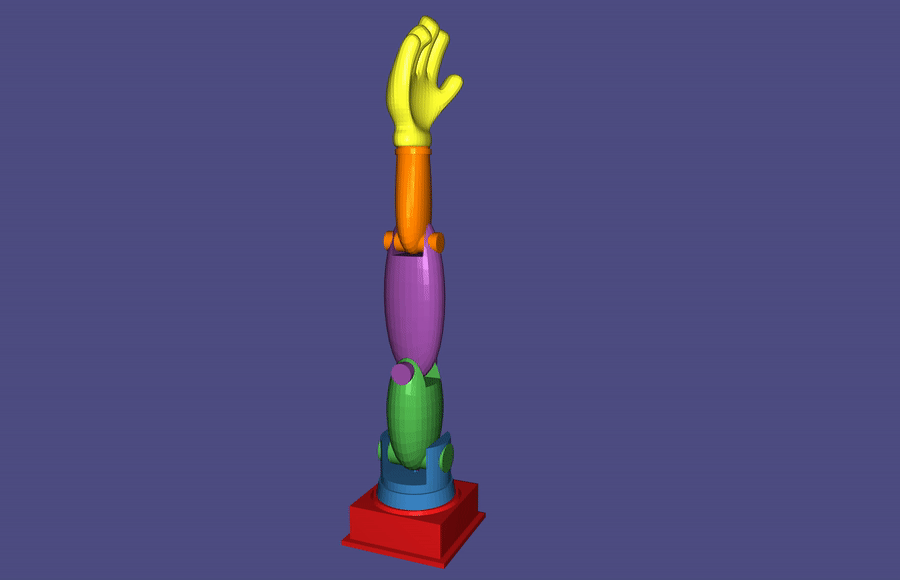
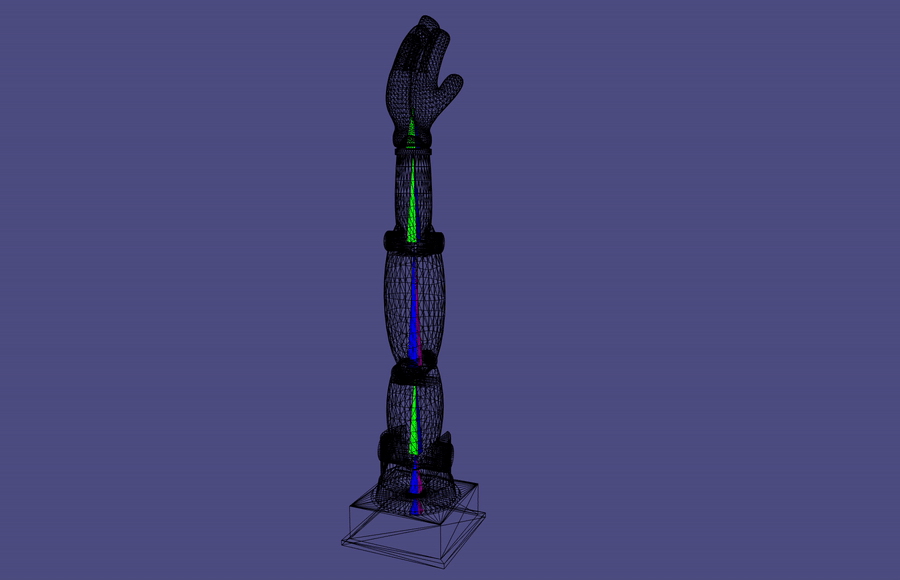
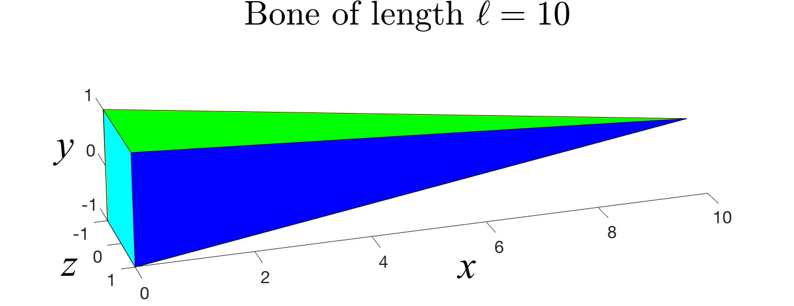
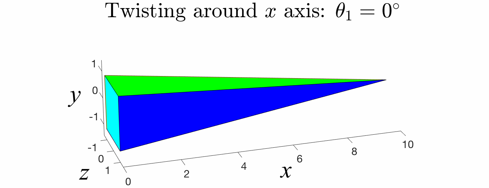
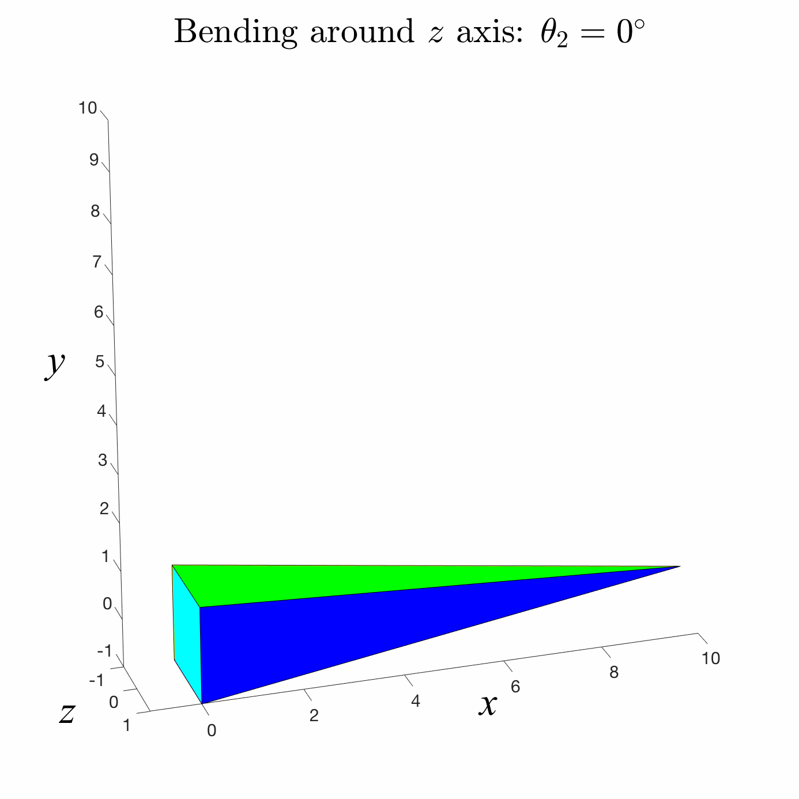
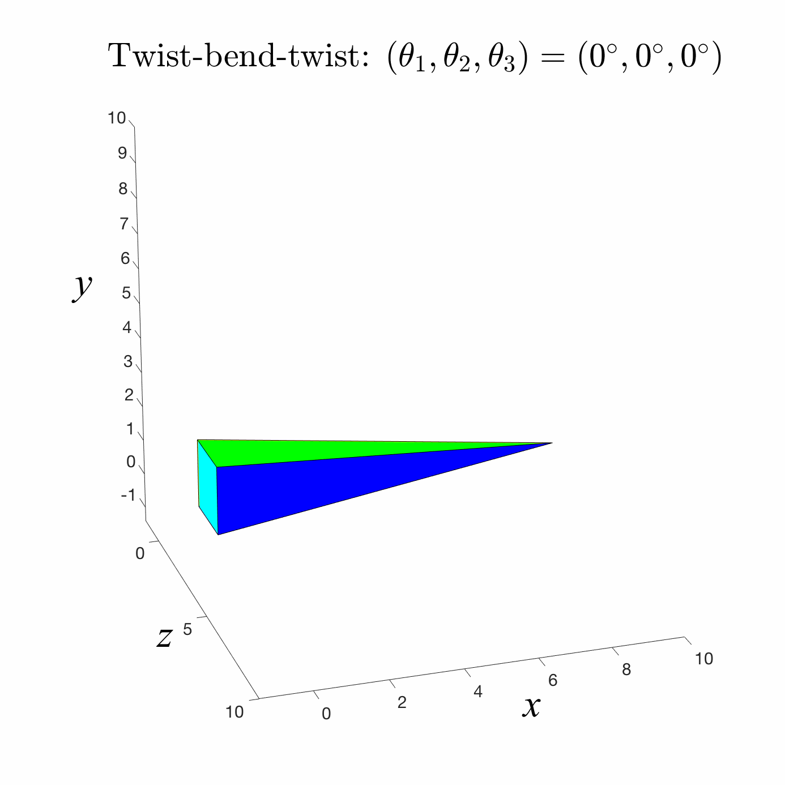
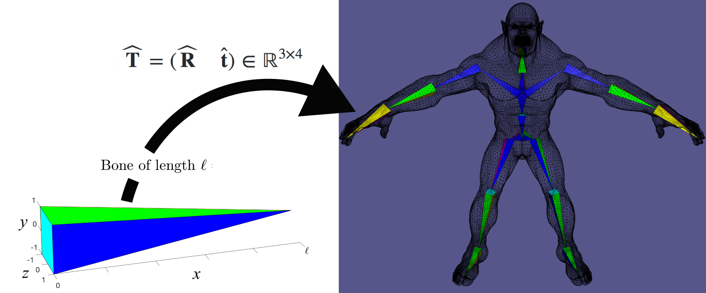
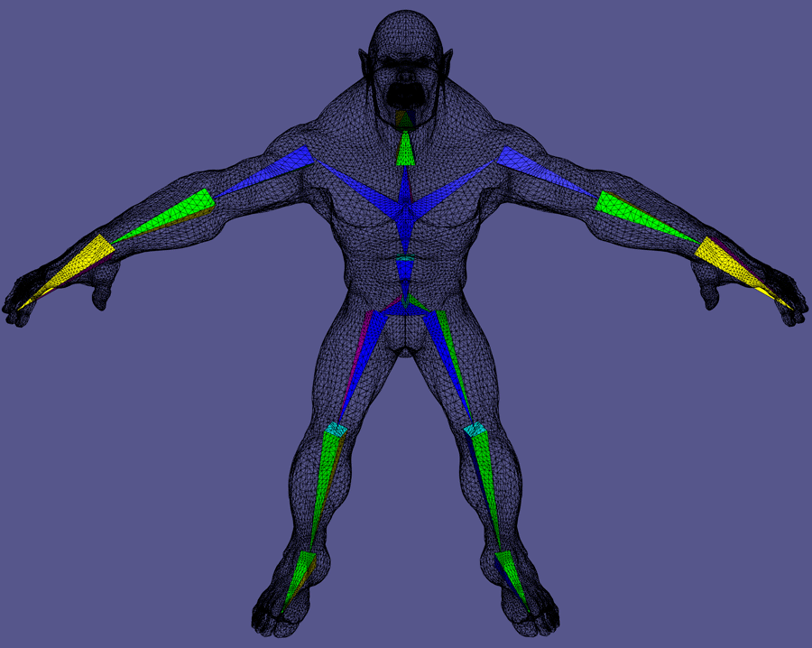
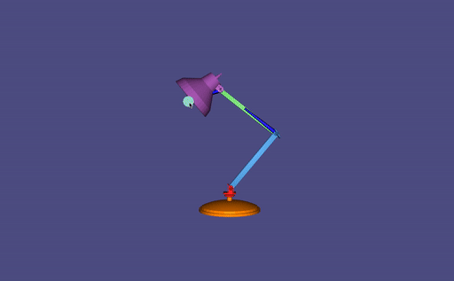
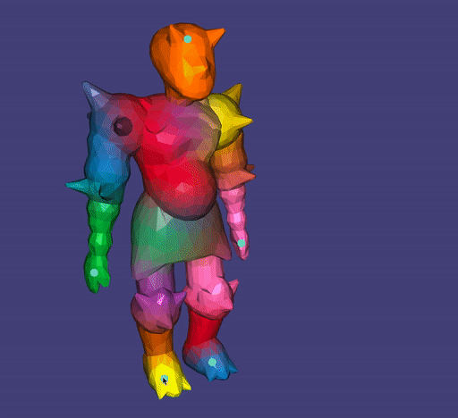

# Computer Graphics – Kinematics

> **To get started:** Clone this repository using
> 
>     git clone --recursive http://github.com/alecjacobson/computer-graphics-kinematics.git
>

## Background

### Read Chapter 15.1-15.5 of _Fundamentals of Computer Graphics (4th Edition)_.

### Read Chapter 16.1-16.4 of _Fundamentals of Computer Graphics (4th Edition)_.

### Skeleton

In this assignment we'll consider animating shapes _rigged_ to an internal
skeleton. The skeleton is a [(graphical) user interface (UI)
_metaphor_](https://en.wikipedia.org/wiki/Interface_metaphor). A skeleton is a
[tree](https://en.wikipedia.org/wiki/Tree_(data_structure)) of rigid bones, not
unlike the [anatomical bones](https://en.wikipedia.org/wiki/Bone) in a human or
animal.

Each "bone" in the skeleton is really a UI widget for visualizing and
controlling a 3D [rigid
transformation](https://en.wikipedia.org/wiki/Rigid_transformation). A common
visualization of 3D bone in computer graphics is a long, pointed [pyramid
shape](https://en.wikipedia.org/wiki/Pyramid_(geometry)). This reveals the
twisting rotation as well as the tree hierarchy: the bone points toward its
children.

_Unlike_ anatomy where the brain triggers muscles to flex and pull the passive
bones around, the bones of a skeleton rig will define the pose of a shape.

For each bone, we will consider _**three**_ "states".

#### 1. Canonical Bone

The "Canonical Bone" of length $\ell$ lies along the $x$-axis with its "tail" at
the origin $(0,0,0)$, its "tip" at $(\ell,0,0)$. 

The bone is endowed with an
orientation or [frame](https://en.wikipedia.org/wiki/Moving_frame). This helps
define a canonical _twisting_ direction. We will define twisting as rotating about the $x$-axis in the canonical frame. 

For example, in this assignment, _bending_ is accomplished by rotating about the
$z$-axis in the canonical frame.

Composing a twist, bend and
another twist spans all possible 3D rotations. 

We call the three angles composed
into a rotation this way, [Euler angles][eulerangles] (not to be confused with
the [homophonous](https://en.wiktionary.org/wiki/homophonous) [Oiler
angles](https://upload.wikimedia.org/wikipedia/commons/9/97/Odessa_TX_Oil_Well_with_Lufkin_320D_pumping_unit.gif)).

#### 2. Rest Bone

To assemble a skeleton inside our shape will we map each bone from its
[canonical bone][1.canonicalbone] to its position _and orientation_ in the
undeformed model. Maintaining the rigidity of the bone, this means for each bone
there's a rigid transformation $\widehat{\mathbf{T}} = (\widehat{\mathbf{R}} \quad \widehat{\mathbf{t}} ) \in 
\mathbf{R}^{3\times 4}$ that places its tail and tip to the desired positions in the model. 

We
use the convention that the "canonical tail" (the origin $(0,0,0)$) is mapped to
the "rest tail" inside the model. This means that the _translation_ part of the
matrix $\widehat{\mathbf{T}}$ is simply the tail position, $\widehat{\mathbf{s}}\in \mathbf{R}^3$:
$$
\widehat{\mathbf{s}} = \widehat{\mathbf{T}} \left(\begin{array}{c}0\\\\{0}\\\\{0}\\\\1\end{array}\right) =
\widehat{\mathbf{R}} \left(\begin{array}{c}0\\\\{0}\\\\{0}\end{array}\right) + \widehat{\mathbf{t}} 1 = \widehat{\mathbf{t}}.
$$

The bone's
rotation is chosen so that the "canonical tip" $(\ell,0,0)$ maps to the "rest
tip" $\widehat{\mathbf{d}} \in  \mathbf{R}^3 $:
$$
\widehat{\mathbf{d}} = 
\widehat{\mathbf{T}} \left(\begin{array}{c}\ell\\\\{0}\\\\{0}\\\\1\end{array}\right) =
\widehat{\mathbf{R}}\left(\begin{array}{c}\ell\\\\{0}\\\\{0}\end{array}\right) + \widehat{\mathbf{t}}.
$$

Typically the "rest tail" of is coincident with the "rest tip" of its
parent (if it exists): 
$$
\widehat{\mathbf{d}}_{p} = \widehat{\mathbf{s}}.
$$

This still leaves any amount of _twisting_ of the bone. In the canonical frame,
we can think of this as pre-twisting the bone along the canonical $x$-axis.
Clearly, twisting does not effect the ability to map the tail and tip to the
correct position. This twist is _chosen_ so that canonical bending aligns with a
meaningful direction. For example, we may twist a [tibia
(shinbone)](https://en.wikipedia.org/wiki/Tibia) bone so that canonical bending
around the $z$-axis means bending at the
[knee](https://en.wikipedia.org/wiki/Knee).

Each rest transformation $\widehat{\mathbf{T}}$ _places_ its corresponding bone inside the
undeformed shape. The rest transformations do not measure any deformation of the
shape from its original position. Thus, the _pose_ of each bone will be measured
_relative_ to the "rest bone".

#### 3. Pose Bone

The final state to consider is when a bone is _posed_. That is, mapped to a new
position and orientation from its rest state. 

In general, each rest bone undergoes a rigid transformation $\mathbf{T} \in  \mathbf{R}^{3\times 4}$,
composed of a rotation $\mathbf{R} \in  \mathbf{R}^{3\times 3}$ and a translation $\mathbf{t}\in \mathbf{R}^{3}$, mapping each of its 
rest points $\widehat{x} \in  \mathbf{R}^3 $ to its corresponding posed postion $\mathbf{x} \in  \mathbf{R}^3 $:

$$
\mathbf{x} = \mathbf{T} \widehat{\mathbf{x}}.
$$

$\mathbf{T}$ is expressed as a _global_ mapping of any point in the rest reference frame
to its pose position. This makes it convenient for [blending transformations
(see below)][linearblendskinning], but it's not so obvious how to pick coherent
values for $\mathbf{T}$. In particular, we would like each bone to rotate about its
parent's tip, but this position is determined by the parent's pose
transformation $\mathbf{T}_p$, which in turn should rotate about the grandparent's tip
and so on.

### Forward Kinematics

One way to determine the rigid pose transformations $\mathbf{T}_i \in  \mathbf{R}^{3\times 4}$ for each
bone $i$ in a skeleton is to aggregate _relative rotations_ $\overline{\mathbf{R}}_i \in 
\mathbf{R}^{3\times 3}$ between a bone $i$ and its parent bone $p_i$ in the skeletal tree.
The final transformation at some bone $i$ deep in the skeletal tree is computed
via a recursive equation.

For each bone, (reading the effect of transformations _right to left_) we first
_undo_ the map from canonical to rest (i.e., via inverting $\widehat{\mathbf{T}}_i$), then
rotate by our relative rotation $\overline{\mathbf{R}}_i$, then map back to rest (via
$\widehat{T}_i$). With our relative transformation accomplished, we continue _up the
tree_ [recursively](https://en.wikipedia.org/wiki/Recursion_(computer_science))
applying our parent's relative transformation, and our grandparent's and so on:
$$
\mathbf{T}_i = \mathbf{T}_{p_i} 
\left(\begin{array}{c} \widehat{\mathbf{T}}_i \\\\ 0\ 0\ 0 \ 1\end{array}\right)
\left(\begin{array}{cccc} \overline{\mathbf{R}}_i      & \begin{array}{c}0\\\\{0}\\\\{0}\\\\\end{array} \\\\ 0\ 0\ 0 & 1\end{array}\right)
\left(\begin{array}{c} \widehat{\mathbf{T}}_i \\\\ 0\ 0\ 0 \ 1\end{array}\right)^{-1}
$$

> **Question:** Does using relative rotations ensure that bone tails stay
> coincident with parent tips?
>
> **Hint:** What do you get if you multiply $\mathbf{T}_i$ and $\widehat{\mathbf{s}}_i$?

As a base case, the _root_ transformation can be defined to be the identity (no
transformation) or the rigid transformation placing the object/character
generally into a larger scene.

This has the great advantage that if the entire model is rotated or translated
at the root, the relative transformations still apply correctly. This property
holds locally, too. If bone $i$ controls the [tibia
(shinbone)](https://en.wikipedia.org/wiki/Tibia) and $\mathbf{R}_i$ applies a bend at
the knee, then twisting and bending at the parent hip bone will naturally
_compose_ with the knee bend.

It is convenient to express the relative rotations of each bone in the
[canonical frame][1.canonicalbone]. We can utilize canonical twist-bend-twist
rotations (three [Euler angles][eulerangles], $\theta _1 ,\theta _2 ,\theta _3 $). Each bone's rotation
is conducted in its canonical frame and then _brought_ through the rest frame
through a change of coordinates:

$$
\mathbf{T}_i 
= 
\mathbf{T}_{p_i} 
\widehat{\mathbf{T}}_i
\left(\begin{array}{cccc} \mathbf{R}_x(\theta _{i3})      & \begin{array}{c}0\\\\{0}\\\\{0}\\\\\end{array} \\\\ 0\ 0\ 0 & 1\end{array}\right)
\left(\begin{array}{cccc} \mathbf{R}_z(\theta _{i2})      & \begin{array}{c}0\\\\{0}\\\\{0}\\\\\end{array} \\\\ 0\ 0\ 0 & 1\end{array}\right)
\left(\begin{array}{cccc} \mathbf{R}_x(\theta _{i1})      & \begin{array}{c}0\\\\{0}\\\\{0}\\\\\end{array} \\\\ 0\ 0\ 0 & 1\end{array}\right)
\left.\widehat{\mathbf{T}}_i\right.^{-1}
$$

where the matrix $\mathbf{R}_w(\varphi ) \in  \mathbf{R}^{3\times 3}$ is the rotation by $\varphi $ degrees around
the $w$-axis.

When implementing a skeleton, it is tempting to use a traditional [tree data
structure](https://en.wikipedia.org/wiki/Tree_(data_structure)) where each node
(bone) contains a list of pointers to its children (other bones).  However, by
the _right-to-left_ reading of the forward kinematics formulae above, it is more
convenient to use a data structure where each node (bone) has a pointer to its
(unique) parent (other bone). This is ridiculously named a [Spaghetti
Stack](https://en.wikipedia.org/wiki/Parent_pointer_tree).

> **Question:** What abstract data-structure is good for ensuring a parent's transformation  $\mathbf{T}_{p_i}$
> are computed before its child's $\mathbf{T}_i$?
>
> **Hint:** 🥞

### Keyframe animation

To create a long animation, specifying three Euler angles for every bone for
every frame manually would be too difficult. The standard way to determine the
relative bone transformations for each frame is to
[interpolate](https://en.wikipedia.org/wiki/Interpolation) values specified at a
small number of "key" times during the animation. [Linear
interpolation](https://en.wikipedia.org/wiki/Linear_interpolation) will lead to
a choppy, robotic animation (try this first!). Instead [Catmull-Rom
interpolation](https://en.wikipedia.org/wiki/Cubic_Hermite_spline#Catmull–Rom_spline)
will produce a smooth animation. Fancier interpolation such as the
[Kochanek-Bartels method](https://en.wikipedia.org/wiki/Kochanek–Bartels_spline)
(called TCB in [the book](https://www.cs.cornell.edu/~srm/fcg4/)) allow better
control of [easing between key
poses](https://en.wikipedia.org/wiki/12_basic_principles_of_animation#Slow_In_and_Slow_Out).

In this assignment, we will interpolate Euler angles directly. This works well
when only a single angle is changing at a time. However, [Euler angles do not
provide easy movement in every rotational
direction](https://en.wikipedia.org/wiki/Gimbal_lock). Euler angles model
rotations as _twist-bend-twist_. For our canonical bones, bending around the
$z$-axis is easy, but bending around the $y$-axis requires first twisting by
$90^\circ $ and then "un"-twisting by $-90^\circ $ after bending.

So, for more complex interpolation of rotations, a different representation such
as [unit quaternions](https://en.wikipedia.org/wiki/Slerp) would be needed. This is
outside the scope of this assignment.

### Inverse Kinematics

In the [forward kinematics][forwardkinematics] model, the final position of the
tip of a finger is determined by setting (manually or via interpolation) the
relative transformations of each joint in the finger, the hand, the elbow, the
shoulder, ... This
[indirect](https://en.wikipedia.org/wiki/Direct_manipulation_interface) control
makes it difficult to achieve basic poses.  Instead, we can treat the problem of
setting relative rotations of internal bones (shoulder, elbow, hand, ...) as an
optimization problem where we try to minimize the distance between the tip of
the finger and where we want it to be.

Stated mathematically, for a skeleton with $m$ bones, if we create a vector
$\mathbf{a} \in  \mathbf{R}^{3m}$ stacking all the Euler angles of each bone vertically:

$$\mathbf{a} = \left(\begin{array}{c}
\theta _{11} \\\\
\theta _{12} \\\\
\theta _{13} \\\\
\theta _{21} \\\\
\theta _{22} \\\\
\theta _{23} \\\\
\vdots \\\\
\theta _{m1} \\\\
\theta _{m2} \\\\
\theta _{m3}
\end{array}\right)
$$

then we can ask for the best vector of angles $\theta $. Best-ness must be quantified
by an cost/energy/obective-function $E$. This energy is typically first written
with respect to the (global, non-relative) pose positions of certains bones
$\mathbf{x}_b \in  \mathbf{R}^3 $ (often the "tip" of a
[leaf](https://en.wikipedia.org/wiki/Tree_(data_structure)#Terminology_used_in_trees)
bone of the skeletal tree, called an [end
effector](https://en.wikipedia.org/wiki/Robot_end_effector)). For example, we 
then we could design our energy to measure the squared distance between the pose
tip $\mathbf{x}_b$ of some bone $b$ and a desired goal location $\mathbf{q}\in \mathbf{R}^3 $:

$$
E(\mathbf{x}_b) = \| \mathbf{x}_b - \mathbf{q}\| ^2 .
$$

Using forward kinematics, we can express $\mathbf{x}_b$ and in turn $E$ with respect to
relative rotations: 

$$
\mathbf{x}_b(\mathbf{a}) = \mathbf{T}_b \widehat{\mathbf{d}}_b
$$

where $\mathbf{T}_b$ depends on $\theta _{b1},\theta _{b2},\theta _{b2}$ and $\mathbf{T}_{p_b}$ which depends on 
$\theta _{p_b1},\theta _{p_b2},\theta _{p_b2}$. In this way our energy can be written as a
function of $\mathbf{a}$:

$$
E(\mathbf{x}_b(\mathbf{a})) = \| \mathbf{x}_b(\mathbf{a}) - \mathbf{q}\| ^2 .
$$

We can design arbitrarily complex energies to satisfy our interaction needs. In
this assignment, we consider that there is a list of constrained end effectors
$b = \{b_1 ,b_2 ,\ldots,b_k\}$ and our objective is that all selected end effectors $b_i$
go to their prescribed locations (provided by the mouse-drag UI).
using the simple squared distance measure above.

So, over all choices of $\mathbf{a}$ we'd like to optimize:

$$
\mathop{\text{min}}_{\mathbf{a}} \quad
\underbrace{
\Sigma \limits_{i=1}^k \| \mathbf{x}_{b_i}(\mathbf{a}) - \widehat{\mathbf{x}}_{b_i}\| ^2 
}_{E(\mathbf{x}_b (\mathbf{a}))}
$$

<!--
Our energy will have two terms.

First, for a certain constrained end effector $b_j$ we ask that it lies as close
as possible to the [viewing
ray](https://en.wikipedia.org/wiki/Ray_tracing_(graphics)) through the user's
[mouse pointer](https://en.wikipedia.org/wiki/Pointer_(user_interface)). 
We can measure the distance between some point $\mathbf{x}$ and the line passing
through the camera/eye location $\mathbf{e}$ and the mouse location _unprojected_ onto
its 3D position on the screen placed in the scene at $\mathbf{m}$ using:

$$
E_\text{mouse}(\mathbf{x}) = \left|\left| (\mathbf{x} - \mathbf{m}) - \left((\mathbf{x} - \mathbf{m})\cdot\frac{\mathbf{e}-\mathbf{m}}{\| \mathbf{e}-\mathbf{m}\| }\right)\frac{\mathbf{e}-\mathbf{m}}{\| \mathbf{e}-\mathbf{m}\| }\right|\right|^2.
$$

This formula can be simplified to a much simpler expression since $\mathbf{m}$ and $\mathbf{e}$
do not depend on $\mathbf{x}$ (left to the reader/implementor).

> **Question:** How would you _alternatively_ write this term by measuring
> distances in image space?
>
> **Hint:** 📽
>

Second, for all of the other end effectors $b_i \left|\right. i\ne j$, we will
constrain their positions to their rest locations $\widehat{\mathbf{x}}_{b_i}$, using the
simple squared distance measure above.

The goal of inverse kinematics is to minimize the sum of these energies over all
choices of $\mathbf{a}$:

$$
\mathop{\text{min}}_{\mathbf{a}} \quad
\underbrace{
E_{\text{mouse}}(\mathbf{x}_{b_j}(\mathbf{a})) + 
\Sigma \limits_{i\ne j} \| \mathbf{x}_{b_i}(\mathbf{a}) - \widehat{\mathbf{x}}_{b_i}\| ^2 
}_{E(\mathbf{x}_b (\mathbf{a}))}
$$
-->

We will further constrain our problem by imposing
[upper and lower bounds](https://en.wikipedia.org/wiki/Constrained_optimization#Inequality_constraints)
on our angles $\mathbf{a}$. These correspond to joint limits. For example, the joint
limits of a hinge or elbow type joint may look like:

$$
0^\circ  \le  \theta _1  \le  0^\circ , \quad 0^\circ  \le  \theta _2  \le  170^\circ , \quad 0^\circ  \le  \theta _3  \le  0^\circ .
$$

These would ensure that our joint cannot twist, and can only bend in one direction.

So our full optimization problem becomes 

$$
\mathop{\text{min}}_{\mathbf{a}^{\text{min}} \le  \mathbf{a} \le 
\mathbf{a}^{\text{max}}}
\quad E(\mathbf{x}_b(\mathbf{a}))
$$

where $\mathbf{a}^{\text{min}}/\mathbf{a}^{\text{max}}$ stack lower/upper bounds correspondingly to $\mathbf{a}$.

This type of minimization is non-trivial. Our energy is a quadratic [sum of
squares](https://en.wikipedia.org/wiki/Linear_least_squares) in $\mathbf{x}_b$, but
$\mathbf{x}_b$ is a non-linear function of $\mathbf{a}$. In turn, this means to minimize $E$ as
a function of $\mathbf{a}$ we must solve a [non-linear least
squares](https://en.wikipedia.org/wiki/Non-linear_least_squares) problem. 

#### Projected Gradient Descent

We're faced with a bound constrained non-linear optimization problem.  To solve
it, we will construct an initial guess and then iteratively improve the guess by
moving in a direction that decreases $E$, after each step _snap_ or project the
guess to stay within the bounds if necessary. This algorithm is called
_projected gradient descent_.

The idea behind [_gradient
descent_](https://en.wikipedia.org/wiki/Gradient_descent) is intuitive: if you
want to get to the bottom of a canyon, look at the ground and walk in the
direction that goes downhill.

So, we iteratively take a step in the _negative_ gradient direction of our
objective function $E(\mathbf{x}(\mathbf{a}))$:

$$
\mathbf{a} \leftarrow  \mathbf{a} - \sigma  \left(\frac{dE(\mathbf{x}(\mathbf{a}))}{d\mathbf{a}}\right)^T
$$

Applying the [chain rule](https://en.wikipedia.org/wiki/Chain_rule), this
iteration becomes

$$
\mathbf{a} \leftarrow  \mathbf{a} - \sigma  \left(\frac{d\mathbf{x}(\mathbf{a})}{d\mathbf{a}}\right)^T\left(\frac{dE(\mathbf{x})}{d\mathbf{x}}\right)
$$

where $\frac{dE}{d\mathbf{a}} \in  \mathbf{R}^{|\mathbf{a}|}$,
$\frac{dE}{d\mathbf{x}} \in  \mathbf{R}^{|\mathbf{x}|}$, and $\frac{d\mathbf{x}}{d\mathbf{a}} \in  \mathbf{R}^{|\mathbf{x}| \times  |\mathbf{a}|}$

The change in tip positions $\mathbf{x}$ with respect to joint angles $\mathbf{a}$ does not
depend on the choice of energy $E$. We call this matrix of changes the kinematic
[Jacobian](https://en.wikipedia.org/wiki/Jacobian_matrix_and_determinant), $\mathbf{J} \in 
\mathbf{R}^{|\mathbf{x}| \times  |\mathbf{a}|}$:

$$
\mathbf{J} = \frac{d\mathbf{x}}{d\mathbf{a}}.
$$

Written in terms of $\mathbf{J}$ our step becomes,

$$
\mathbf{a} \leftarrow  \mathbf{a} - \sigma  \mathbf{J}^{\mathsf T}\left(\frac{dE(\mathbf{x})}{d\mathbf{x}}\right)
$$

> **Question:** Can we take an arbitrarily large step $\sigma >>0$?
>
> **Hint:** What if we just need to change $\mathbf{a}$ by a small, non-zero amount?
> What would chooing $\sigma =1,000,000$ do to $\mathbf{a}$? What would that in turn do to
> $E(\mathbf{x}(\mathbf{a}))$?

For sufficiently small $\sigma $, each step will decrease the objective energy $E$.

If the gradient of $E$ becomes zero, then we're at a [stationary
point](https://en.wikipedia.org/wiki/Stationary_point) and likely at a minimum.

To ensure that our bounds are obeyed, after each step we need to _project_ onto
our constraints by snapping each value to its respective bound if necessary:

$$
\mathbf{a}_i \leftarrow  \max[\mathbf{a}^\text{min}_i, \mathop{\text{min}}[\mathbf{a}^\text{max}_i,\mathbf{a}_i]].
$$

We'll refer to this as a projection filter acting on the entire vector $\mathbf{a}$:

$$
\mathbf{a} \leftarrow  \text{proj}(\mathbf{a}).
$$

> #### Newton's method
> 
> The local gradient of a function can be very different from the "best" descent
> direction. The choice of $\sigma $ reflects how much we "trust" this direction.
> Unfortunately, if $\sigma $ is too large our iterations may diverge. If $\sigma $ is too
> small, we will have to do many iterations.
> 
> In order to find a _better_ descent direction, let's assume we knew _more_ about
> $E$. That is, suppose we also knew its second derivatives: $\frac{d^2 E}{d\mathbf{x}^2 }$. 
> 
> Given an initial guess $\mathbf{x}^0 $ we're looking to find a change $\Delta \mathbf{x}$ so that $E(\mathbf{x}^0 + \Delta \mathbf{x})$ is a stationary point.
> 
> Starting with our equilibrium equation,
> $$\frac{dE(\mathbf{x})}{d\mathbf{x}} = \mathbf{0}$$
> 
> we substitute in $x = \mathbf{x}^0  + \Delta \mathbf{x}$
> 
> $$\frac{dE(\mathbf{x}^0 +\Delta \mathbf{x})}{d\Delta \mathbf{x}} = \mathbf{0}$$
> 
> Plugging in a [Taylor series](https://en.wikipedia.org/wiki/Taylor_series)
> expansion
> 
> $$E(\mathbf{x}^0 +\Delta \mathbf{x}) \approx E(\mathbf{x}^0 ) + \frac{d E(\mathbf{x}^0 +\Delta \mathbf{x})}{d\mathbf{x}} \Delta \mathbf{x} +
> \frac{d^2 E(\mathbf{x}^0 +\Delta \mathbf{x})}{d\mathbf{x}^2 }\frac{(\Delta \mathbf{x})^2 }{2} + \ldots$$
> 
> and dropping higher order terms ($\ldots$), we get:
> 
> $$\frac{d}{d\Delta \mathbf{x}}(E(\mathbf{x}^0 ) + \frac{d E(\mathbf{x}^0 +\Delta \mathbf{x})}{d\mathbf{x}} \Delta \mathbf{x} + \underbrace{\frac{d^2 E(\mathbf{x}^0 +\Delta \mathbf{x})}{d\mathbf{x}^2 }}_\mathbf{H}\frac{(\Delta \mathbf{x})^2 }{2}) = \mathbf{0},$$
> 
> where we call $\mathbf{H} \in  \mathbf{R}^{|x| \times  |x|}$ the [Hessian
> matrix](https://en.wikipedia.org/wiki/Hessian_matrix).  
> 
> Applying the differentiation by $\Delta \mathbf{x}$ we get a system of equations:
> 
> $$\frac{d E(\mathbf{x}^0 +\Delta \mathbf{x})}{d\mathbf{x}} + \frac{d^2 E(\mathbf{x}^0 +\Delta \mathbf{x})}{d\mathbf{x}^2 } \Delta \mathbf{x} = \mathbf{0}.$$
>
> Solving for the change $\Delta x$ we get:
>
> $$\Delta x = -\left.\mathbf{H}\right.^{-1} \frac{d E(\mathbf{x}^0 +\Delta \mathbf{x})}{d\mathbf{x}}.$$
> 
> So a _raw_ Newton's method update would be:
> 
> $$\mathbf{x} \leftarrow  \mathbf{x} - \left.\mathbf{H}\right.^{-1} \frac{d E(\mathbf{x}^0 +\Delta \mathbf{x})}{d\mathbf{x}}.$$
> 
> If our Taylor series approximation was perfect (no high order terms in $\ldots$; in
> otherwords $E$ was quadratic), then Newton's method would be perfect: a single
> update immediately takes us to the minimum.
> 
> Newton's method is problematic for a number of reasons.
> 
>  1. We built our step purely based on the equations for a stationary point.
>     Nothing says we won't get sent toward a maximum or saddle-point. 
>  2. $\mathbf{H}$ is often difficult or expensive to compute.
>  4. $\mathbf{H}$ may be singular.
>  3. Inverting $\mathbf{H}$ (even if possible) is often slow.
>  5. Our system is built off a local approximation of $E$ so the descent
>     direction may _still_ point in the wrong direction.
> 
> Since we're approximating $E$ at every iteration anyway, we'll skirt many of
> these issues by considering various approximations of the Hessian matrix $\mathbf{H}$.
> We'll never actually compute $\mathbf{H}$.
> 
> #### Gradient Descent _Revisited_
> 
> The simplest approximation of $\mathbf{H}$ is the identity matrix $\mathbf{I}$. Plugging this
> into our truncated Taylor series expansion above, our approximation would read:
> 
> $$E(\mathbf{x}^0 ) + \frac{d E(\mathbf{x}^0 +\Delta \mathbf{x})}{d\mathbf{x}} \Delta \mathbf{x} + \mathbf{I} \frac{(\Delta \mathbf{x})^2 }{2}.$$
> 
> and our step reduces to good ol' gradient descent:
> 
> $$\mathbf{x} \leftarrow  \mathbf{x} - \frac{d E(\mathbf{x}^0 +\Delta \mathbf{x})}{d\mathbf{x}}.$$
> 
> #### Gauss-Newton
>
> Given that we have already computed first derivatives in the Jacobian $\mathbf{J}
> =\frac{d\mathbf{x}(\mathbf{a})}{d\mathbf{a}}$, an even better approximation for Hessian $\mathbf{H}$ than the
> identity $\mathbf{I}$ would be to use $\mathbf{J}^{\mathsf T} J$. The resulting update becomes:
>
> $$\mathbf{a} \leftarrow  \mathbf{a} + (\left.\mathbf{J}\right.^{\mathsf T}\mathbf{J})^{-1} \left.\mathbf{J}\right.^{\mathsf T} \frac{dE(\mathbf{x})}{d\mathbf{x}}$$
>
> Unlike $\mathbf{H}$, $\mathbf{J}^{\mathsf T}\mathbf{J}$ is easy to compute if we're already computing
> $\mathbf{J}$. It is guaranteed to be [positive
> semi-definite](https://en.wikipedia.org/wiki/Positive-definite_matrix) and it
> is possible to invert or reliably
> [pseudo-invert](https://en.wikipedia.org/wiki/Moore–Penrose_inverse) ($\mathbf{J}^+$
> acting in place of $(\left.\mathbf{J}\right.^{\mathsf T}\mathbf{J})^{-1}
> \left.\mathbf{J}\right.^{\mathsf T}$).
>
> The descent directions are often significantly better than gradient descent.
> As a result this method, called Gauss-Newton, requires many fewer iterations
> to converge.
>
> It still may try to descend in bad directions. In particular, for inverse
> kinematics, this Gauss-Newton method performs poorly if the desired positions
> are not reachable: over extending an arm. First the solution locks in place
> and then diverges. This happens when our Hessian approximation
> $\mathbf{J}^{\mathsf T}\mathbf{J}$ starts misbehaving.
>
> A good fix is to blend between the gradient descent and Gauss-Newton search
> directions. That is blend between $\mathbf{I}$ and $\mathbf{J}^{\mathsf T}\mathbf{J}$. This is called
> the [Levenberg-Marquadt
> algorithm](https://en.wikipedia.org/wiki/Levenberg–Marquardt_algorithm).

#### Finite Differencing

But how do we compute the kinematic Jacobian $\mathbf{J}$? Since each entry in $\mathbf{x}$ is
the result of forward kinematics and not just a math expression, it's not
immediately obvious how to determine its derivatives. However, a derivative is
nothing more than the limit of a small change output divided by a small change
in the input:

$$
\mathbf{J}_{i,j} = \lim_{h \rightarrow  0} \frac{\mathbf{x}_i(\mathbf{a}+h \delta _j) - \mathbf{x}_i(\mathbf{a})}{h},
$$

where $\delta _j \in  \mathbf{R}^{|a|}$ is a vector of zeros except a 1 at location $j$.

We can numerically approximate this limit by fixing $h$ to a small value (e.g.,
$h=10^{-7}$). This is called the [finite
difference](https://en.wikipedia.org/wiki/Finite_difference) approximation:

$$
\mathbf{J}_{i,j} \approx  \frac{\mathbf{x}_i(\mathbf{a}+h \delta _j) - \mathbf{x}_i(\mathbf{a})}{h}.
$$

For inverse kinematics, we will need to compute $\mathbf{x}_i(\mathbf{a}+h \delta _j)$ once for each
Euler angle of each bone $j$. This requires $3m$ calls to our forward kinematics
function (each with a slightly different input), which is in turn $O(m)$. This
makes the total cost $O(m^2 )$ to fill in our $\mathbf{J}$ matrix.

>
> #### Automatic Differentiation
>
> Forward differencing requires $O(m)$ evaluations but doesn't require us to
> change our code for function evaluation _at all_: we just evaluate it. If
> we're willing to sprinkle some special types on top of our code (but otherwise
> leave in all the sub-routine calls, if statements, for loops, etc.), we could
> use [automatic
> differentiation](https://en.wikipedia.org/wiki/Automatic_differentiation) to
> compute $\mathbf{J}$.
>
> The are two extremes when it comes to autodiff: forward mode and backward
> mode. 
>
> **Forward mode** works like finite differencing, except the perturbation to
> the differentiation variable is symbolic and derivatives are tracked through
> each basic operation (`+`,`-`,`sin`,etc.): the total computational cost to
> construct $\mathbf{J}$ is again $O(m^2 )$.
>
> **Backward mode** works by pushing each function call and basic operation onto
> a list.  Derivatives for all variables are then computed as we pop backward
> through the evaluation: identical to how we read right-to-left on our
> recursive kinematics formula. This means we compute derivatives with respect
> to all variables $\mathbf{a}$ in a single _backwards_ evaluation. The total cost is
> only $O(m)$ to fill $\mathbf{J}$. 
>

#### Line Search

Whether we're using gradient descent, Newton's method or Gauss-Newton, we a
generally _attempting_ improving our guess by iteratively moving in a descent
direction $\Delta \mathbf{a}$, followed by projecting onto constraints:

$$
\mathbf{a} \leftarrow  \text{proj}(\mathbf{a} + \Delta \mathbf{a}).
$$

Despite our best efforts, this step is not guaranteed to actually decrease
our energy $E$. We can think of the descent _direction_ $\Delta \mathbf{a}$ as defining a line (or really
a _ray_) and we'd like to find a positive amount $\sigma $ to move along this line that actually
does decrease the energy:

$$
E(\text{proj}(\mathbf{a} + \sigma  \Delta \mathbf{a})) < E(\mathbf{a}).
$$

While there exists an optimal step $\sigma $, we don't want to spend too long finding
it as we would be better off spending our computational efforts improving the
descent _direction_ for the next step. So, starting with a large value $\sigma $
(e.g., 10,000), we decrease $\sigma $ by a constant factor (e.g., $\frac12 $) until our
inequality passes.

Depending on the configuration, it may or may not be possible to exactly satisfy
the constraints (i.e., $E = 0$). But after many iterations, the solution should
converge to a [local minimum](https://en.wikipedia.org/wiki/Maxima_and_minima)
(i.e., $E>0$, but $dE/d\mathbf{a} = 0$). In our assignment, a thin line will appear if
the user-given constraint is not coincident with the end-effector tip position.

 
### Linear Blend Skinning

So far we have only discussed bones floating and moving around in space.
Ultimately, we would like to deform interesting models: for example, animals and
characters. Unlike robots or mechanical objects, the animals tend to deform
smoothly, even near joints: an elbow does not tear into two rigid parts when
bent. Instead, the skin around the elbow stretches and smoothly warps. Skin
closer to the forearm deforms more like the rigid rotation and translation of
the forearm, and likewise the skin near the upper arm deforms like the rigid
upper arm bone. In between, we see a smooth transition or blend.

To approximate this smooth blending quickly on the computer, we begin with a 3D
triangle mesh in its "rest" position. The "rest bones" are embedded inside of
this model. Each vertex $i$ of the mesh is assigned a weight $w_{i,j}$ for each
bone $j$ corresonding to how much it is "attached" to that bone on a scale of 0%
to 100%. Generally, if the rest position of the vertex $\widehat{\mathbf{v}}_i$ is nearer to
a bone $j$ then its weight $w_{i,j}$ will be larger. A vertex in the middle of
the elbow may have  a weight of 50% for the upper arm and 50% the forearm and
0% for all other bones (toes, fingers, legs, spine, etc.).

Smoothly varying weights produce a smooth deformation. In constrast,
piecewise-constant weights lead to a piece-wise rigid deformation.

The "pose" position $\mathbf{v}_i$ of this vertex $i$ will be computed as a weighted
average or linear combination of each bone's pose transformation $\mathbf{T}_j$ applied
to the vertex's rest position $\widehat{\mathbf{v}}_i$:

$$
\mathbf{v}_i = 
\sum\limits^{m}_{j=1}
w_{i,j}
\mathbf{T}_j
\left(\begin{array}{c}\widehat{\mathbf{v}}_i\\\\1\end{array}\right).
$$

> **Question:** What happens to per-vertex normals after applying a skinning
> deformation?
>
> **Hint:** 🤯

Linear blend skinning has many defects. Good "rigging artists" can mitigate
these by carefully painting (yes, painting) weight functions and position the
[rest bones][2.restbone]. However, some of the linear blend skinning defects are
theoretical: most notably problems that occur by averaging
rotations as matrices. 

> **Question:** What transformation matrix do you get if you compute: $\frac12  \mathbf{R}_x(90^\circ ) + \frac12  \mathbf{R}_x(-90^\circ )$?
>
> **Hint:** It's not $\mathbf{R}_x(0^\circ )$.

## Tasks

### White List

 - `Eigen::Affine3d`
 - [`Eigen::AngleAxis`](https://eigen.tuxfamily.org/dox/classEigen_1_1AngleAxis.html)
 - `#include <Eigen/Geometry>`
 - c++ lambda functions and capturing `#include <functional>`

### Black List

 - `igl::lbs`
 - `igl::forward_kinematics`

### `src/euler_angles_to_transform.cpp`

### `src/forward_kinematics.cpp`

### `src/transformed_tips.cpp`

### `src/catmull_rom_interpolation.cpp`

### `src/linear_blend_skinning.cpp`

### `src/copy_skeleton_at.cpp`

### `src/end_effectors_objective_and_gradient.cpp`

### `src/kinematics_jacobian.cpp`

### `src/projected_gradient_descent.cpp`

### `src/line_search.cpp`

[eulerangles]: https://en.wikipedia.org/wiki/Euler_angles

> ## Notes for TAs editing the README
>
> This README file is too complex for [texify](https://github.com/apps/texify) to render. Use [readme2tex](https://github.com/leegao/readme2tex) locally to render the TeX to SVGs.
>
> `python -m readme2tex --output README.md README.tex.md --nocdn`
> 
> `sed -i 's/invert_in_darkmode\"/invert_in_darkmode\&sanitize=true\"/g' README.md`
